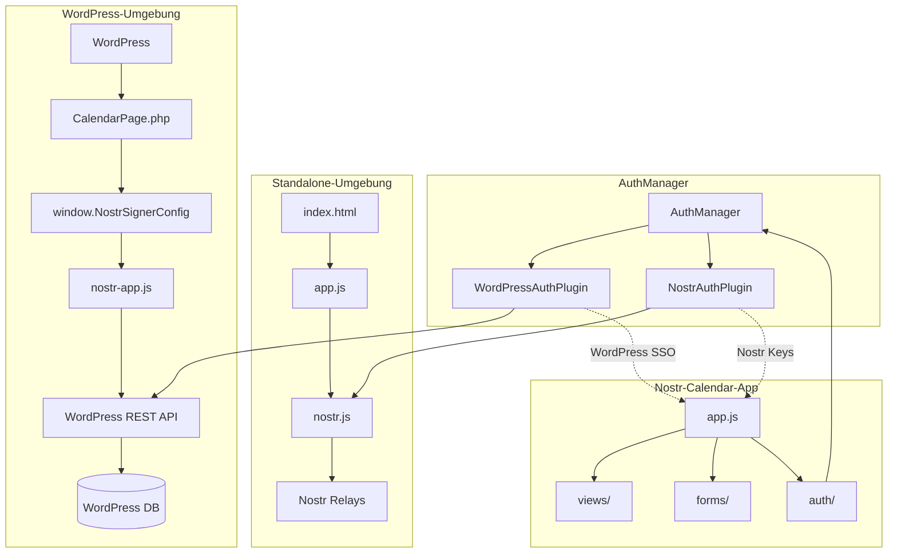

# Nostr-Calendar-App WordPress Integration - Agent Plan

## Übersicht
Dieses Dokument beschreibt die vollständige Integration der Nostr-Calendar-App in WordPress über das wp_nostr Plugin. Die App soll sowohl standalone als auch in WordPress-Umgebungen funktionieren.

## Architektur

### Komponenten
- **WordPressAuthPlugin.js**: Authentifizierungs-Plugin für WordPress-SSO
- **AuthManager**: Zentrale Authentifizierungsverwaltung
- **CalendarPage.php**: WordPress-Seite für App-Auslieferung
- **nostr-app.js**: JavaScript-Bibliothek für WordPress-Nostr-Integration

### Datenfluss


## Implementierungsphasen

### Phase 1: WordPressAuthPlugin.js vervollständigen
**Status**: In Bearbeitung

**Aufgaben**:
- [x] NIP-52 Event-Formatierung implementieren (kind 31923)
- [x] createEvent() Methode mit WordPress-Signierung
- [x] deleteEvent() Methode mit NIP-9 DELETE Events
- [x] login()/logout() Methoden implementieren
- [x] WordPress-REST-API Integration

**Technische Details**:
- Event-Kind: 31923 (NIP-52 Live Activities)
- Signierung über `/wp-json/nostr-signer/v1/sign-event`
- Authentifizierung über WordPress-Session
- Relay-Publikation über nostr-app.js

### Phase 2: Dateien kopieren und anpassen
**Status**: Ausstehend

**Aufgaben**:
- [ ] Alle Nostr-Calendar-App-Dateien nach `wp-content/nostr-apps/` kopieren
- [ ] Pfad-Anpassungen für WordPress-Umgebung
- [ ] Standalone-Kompatibilität sicherstellen
- [ ] Asset-URLs anpassen

### Phase 3: WordPress-Plugin-Integration
**Status**: Ausstehend

**Aufgaben**:
- [ ] wp_nostr.php Hauptdatei erstellen
- [ ] CalendarPage.php Integration
- [ ] wp-config.php Konfiguration
- [ ] Plugin-Aktivierungs-Handler

### Phase 4: Testing und Validierung
**Status**: Ausstehend

**Aufgaben**:
- [ ] WordPress-SSO-Authentifizierung testen
- [ ] NIP-52 Event-Signierung testen
- [ ] Standalone-Betrieb testen
- [ ] Integration zwischen Modi testen

### Phase 5: Dokumentation
**Status**: Ausstehend

**Aufgaben**:
- [ ] WP-Integration.md erstellen
- [ ] Administrator-Guide
- [ ] Entwickler-Dokumentation
- [ ] Troubleshooting-Guide

## Technische Spezifikationen

### NIP-52 Event Format
```javascript
const nostrEvent = {
  kind: 31923, // NIP-52 Live Activities
  created_at: Math.floor(Date.now() / 1000),
  tags: [
    ['title', eventData.title],
    ['start', eventData.start.toString()],
    ['end', eventData.end.toString()],
    ['location', eventData.location || ''],
    ['description', eventData.description || ''],
    ['p', this.getPublicKey()], // Author
    ['t', 'calendar'],
    ['t', 'meeting']
  ],
  content: eventData.content || ''
};
```

### WordPress REST API Integration
```javascript
const result = await nostr_send(
  nostrEvent,
  'user', // WordPress-Benutzer-Schlüssel
  window.NostrSignerConfig?.defaultRelays || ['wss://relay.damus.io'],
  {
    publish: true,
    signPayload: {
      source: 'nostr-calendar-app',
      wordpress_user_id: this.currentSession?.user?.id
    }
  }
);
```

### Authentifizierung
- WordPress-Session basierte Authentifizierung
- Automatische Plugin-Erkennung
- Fallback auf Nostr-Auth bei Bedarf
- Session-Management über localStorage

## Dateien und Verzeichnisse

### WordPress-Plugin Struktur
```
wp_nostr/
├── wp_nostr.php                    # Haupt-Plugin-Datei
├── includes/
│   ├── Rest/
│   │   └── SignEventController.php # REST API Endpoints
│   └── Frontend/
│       └── CalendarPage.php        # App-Auslieferung
├── assets/
│   ├── js/
│   │   └── nostr-app.js           # Nostr-Bibliothek
│   └── nostr-calendar-app/        # Kopierte App-Dateien
│       ├── index.html
│       ├── js/
│       ├── css/
│       └── docs/
└── README.md
```

### Standalone Struktur
```
nostr-calendar-app/
├── index.html
├── js/
│   ├── app.js
│   ├── auth.js
│   ├── nostr.js
│   └── auth/
│       ├── AuthManager.js
│       ├── AuthPluginInterface.js
│       ├── WordPressAuthPlugin.js
│       └── NostrAuthPlugin.js
├── css/
└── docs/
```

## Abhängigkeiten

### Externe Abhängigkeiten
- nostr-tools (für Event-Signierung und Relay-Kommunikation)
- WordPress REST API (für server-seitige Signierung)
- WebCrypto API (für client-seitige Verschlüsselung)

### Interne Abhängigkeiten
- AuthManager für Plugin-Koordination
- AuthPluginInterface für Plugin-Standardisierung
- NostrAuthPlugin für direkte Nostr-Authentifizierung

## Sicherheitsaspekte

### WordPress-Integration
- Server-seitige Schlüsselverwaltung
- CSRF-Schutz über WordPress Nonces
- Session-basierte Authentifizierung
- Keine Client-seitige Schlüsselübertragung

### Standalone-Betrieb
- Client-seitige Schlüsselverwaltung
- Lokale Verschlüsselung mit WebCrypto
- Session-basierte Speicherung
- Keine Server-Abhängigkeiten

## Testfälle

### WordPress-Modus
- [ ] WordPress-SSO Login funktioniert
- [ ] NIP-52 Events werden korrekt signiert
- [ ] Events werden an Relays publiziert
- [ ] Event-Löschung funktioniert (NIP-9)
- [ ] Session-Management funktioniert

### Standalone-Modus
- [ ] Direkte Nostr-Authentifizierung funktioniert
- [ ] Manuelle Schlüssel-Eingabe funktioniert
- [ ] NIP-07 Browser-Extension funktioniert
- [ ] Event-Signierung funktioniert
- [ ] Relay-Kommunikation funktioniert

### Hybrid-Modus
- [ ] Automatische Plugin-Erkennung
- [ ] Nahtloser Wechsel zwischen Modi
- [ ] Fallback-Mechanismen funktionieren
- [ ] UI-Updates korrekt

## Deployment

### WordPress-Plugin
1. Plugin-Dateien in `wp-content/plugins/wp_nostr/` kopieren
2. wp-config.php um Nostr-Schlüssel erweitern
3. Plugin über WordPress-Admin aktivieren
4. CalendarPage.php für URL-Routing aktivieren

### Standalone-App
1. App-Dateien auf Webserver hochladen
2. index.html als Startseite konfigurieren
3. CORS-Einstellungen für Relay-Kommunikation prüfen
4. HTTPS für WebCrypto-Verschlüsselung sicherstellen

## Monitoring und Debugging

### Logging
- Browser-Konsole für Client-seitige Logs
- WordPress-Debug-Log für Server-seitige Logs
- Relay-Kommunikation über nostr-tools

### Debugging-Tools
- WordPress-Plugin: WP_DEBUG Modus
- Nostr-Events: Nostr-Debugger
- Authentifizierung: Browser-DevTools Network-Tab

## Wartung

### Updates
- WordPress-Plugin über WordPress-Admin aktualisieren
- Nostr-Calendar-App manuell aktualisieren
- Abhängigkeiten regelmäßig prüfen

### Backup
- WordPress-Datenbank-Backup (enthält verschlüsselte Nostr-Schlüssel)
- Standalone-App-Dateien sichern
- Relay-Kommunikation protokollieren

## Nächste Schritte

1. **Sofort**: WordPressAuthPlugin.js mit NIP-52 Support implementieren
2. **Kurzfristig**: Dateien kopieren und WordPress-Plugin erstellen
3. **Mittelfristig**: Umfassende Tests durchführen
4. **Langfristig**: Dokumentation und Benutzerführung erstellen