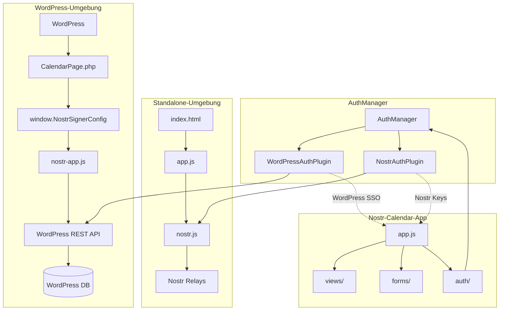

# WordPress Integration für Nostr-Calendar-App

## Übersicht

Dieses Dokument beschreibt die vollständige Integration der Nostr-Calendar-App in WordPress über das wp_nostr Plugin. Die Integration ermöglicht es WordPress-Benutzern, sich automatisch anzumelden und Nostr-Events zu signieren, während die App weiterhin unabhängig von WordPress funktionieren kann.

## Architektur

### System-Komponenten



### Datenfluss

1. **WordPress-Modus**: Benutzer meldet sich bei WordPress an → Session wird erstellt → Nostr-Calendar-App nutzt WordPress-Schlüssel für Event-Signierung
2. **Standalone-Modus**: App läuft unabhängig → Direkte Nostr-Authentifizierung → Lokale Schlüsselverwaltung
3. **Hybrid-Modus**: Automatische Erkennung der Umgebung → Nahtloser Wechsel zwischen Modi

## Installation

### Voraussetzungen

1. **WordPress-Installation** mit aktiviertem wp_nostr Plugin
2. **Nostr-Calendar-App** Dateien in `wp-content/nostr-apps/`
3. **Konfiguration** in `wp-config.php`

### wp-config.php Konfiguration

```php
// Nostr Signer Konfiguration
define('NOSTR_SIGNER_MASTER_KEY', 'base64:BitteMitSicheremZufallswertErsetzen=');
define('NOSTR_SIGNER_ACTIVE_KEY_VERSION', 2);
define('NOSTR_SIGNER_MAX_KEY_VERSIONS', 2);
define('NOSTR_SIGNER_KEY_V1', 'base64:AltKeyBasis64==');
define('NOSTR_SIGNER_KEY_V2', 'base64:AktiverKeyBasis64==');

// Nostr-Calendar-App spezifische Einstellungen
define('NOSTR_CALENDAR_DEFAULT_RELAYS', [
    'wss://relay.damus.io',
    'wss://relay.snort.social',
    'wss://nostr-pub.wellorder.net'
]);
```

### Plugin-Aktivierung

1. Plugin-Dateien in `wp-content/plugins/wp_nostr/` kopieren
2. Plugin über WordPress-Admin aktivieren
3. Permalinks neu speichern (für `/nostr-calendar/` Route)
4. Nostr-Calendar-App Dateien nach `wp-content/nostr-apps/` kopieren

## Konfiguration

### WordPress-REST-API Endpunkte

Die Integration nutzt folgende REST-API Endpunkte:

- `POST /wp-json/nostr-signer/v1/sign-event` - Event-Signierung
- `GET /wp-json/nostr-signer/v1/me` - Benutzerprofil
- `POST /wp-json/nostr-signer/v1/import-key` - Schlüsselimport

### Frontend-Konfiguration

Die CalendarPage.php injiziert automatisch die notwendige Konfiguration:

```javascript
window.NostrSignerConfig = {
    pluginUrl: 'https://example.com/wp-content/plugins/wp_nostr/',
    signUrl: '/wp-json/nostr-signer/v1/sign-event',
    meUrl: '/wp-json/nostr-signer/v1/me',
    nonce: 'wp_rest_nonce_123',
    loginUrl: '/wp-login.php',
    logoutUrl: '/wp-login.php?action=logout',
    apiBase: '/wp-json/',
    defaultRelays: ['wss://relay.damus.io', 'wss://relay.snort.social']
};
```

## Nutzung

### WordPress-SSO Authentifizierung

1. **Automatische Erkennung**: Das System erkennt automatisch, ob WordPress-SSO verfügbar ist
2. **Session-Management**: WordPress-Session wird für Nostr-Authentifizierung genutzt
3. **Fallback**: Bei Bedarf Fallback auf direkte Nostr-Authentifizierung

### Event-Management

#### NIP-52 Event-Erstellung

```javascript
// WordPress-SSO Modus
const eventData = {
    title: 'Team Meeting',
    start: Date.now() + 3600000, // 1 Stunde in Zukunft
    end: Date.now() + 7200000,   // 2 Stunden in Zukunft
    location: 'Konferenzraum A',
    description: 'Wöchentliches Team-Meeting'
};

// Automatische NIP-52 Formatierung (kind 31923)
const result = await authManager.createEvent(eventData);
```

#### NIP-9 Event-Löschung

```javascript
// Event-Löschung über WordPress-SSO
const deleteResult = await authManager.deleteEvent(eventId);
```

### Standalone-Betrieb

Die App funktioniert weiterhin unabhängig von WordPress:

```javascript
// Direkte Nostr-Authentifizierung
const nostrPlugin = authManager.getPlugin('nostr');
await nostrPlugin.login({ method: 'nip07' });

// Manuelle Schlüssel-Eingabe
await nostrPlugin.login({ method: 'manual', nsec: 'nsec1...' });
```

## Sicherheit

### WordPress-Integration

- **Server-seitige Schlüsselverwaltung**: Private Schlüssel verlassen nie den Server
- **CSRF-Schutz**: WordPress Nonces schützen vor Cross-Site-Request-Forgery
- **Session-basierte Authentifizierung**: WordPress-Session-Management
- **Verschlüsselte Speicherung**: Nostr-Schlüssel werden verschlüsselt in der Datenbank gespeichert

### Standalone-Betrieb

- **Client-seitige Schlüsselverwaltung**: Private Schlüssel bleiben im Browser
- **WebCrypto-Verschlüsselung**: Lokale Verschlüsselung mit PBKDF2 + AES-GCM
- **Session-basierte Speicherung**: Verschlüsselte Schlüssel in localStorage/Cookies

## API-Referenz

### WordPressAuthPlugin Methoden

```javascript
class WordPressAuthPlugin extends AuthPluginInterface {
    async initialize() // Plugin-Initialisierung
    async isLoggedIn() // Prüfung WordPress-Session
    async getIdentity() // WordPress-Benutzer-Info
    async login(credentials) // WordPress-Login
    async logout() // WordPress-Logout
    async createEvent(eventData) // NIP-52 Event-Erstellung
    async deleteEvent(eventId) // NIP-9 Event-Löschung
    async getPublicKey() // Öffentlicher WordPress-Schlüssel
    async getDisplayName() // WordPress-Benutzername
}
```

### AuthManager Integration

```javascript
// Automatische Plugin-Erkennung
const activePlugin = await authManager.getActivePlugin();

// Event-Erstellung über aktives Plugin
const result = await authManager.createEvent(eventData);

// Plugin-spezifische Operationen
const wpPlugin = authManager.getPlugin('wordpress');
const nostrPlugin = authManager.getPlugin('nostr');
```

## Troubleshooting

### Häufige Probleme

1. **WordPress-SSO nicht erkannt**
   - Prüfen Sie `window.NostrSignerConfig`
   - Stellen Sie sicher, dass wp_nostr Plugin aktiviert ist
   - Überprüfen Sie WordPress-Session

2. **Event-Signierung fehlgeschlagen**
   - Prüfen Sie wp-config.php Nostr-Schlüssel-Konfiguration
   - Überprüfen Sie WordPress-Benutzer-Berechtigungen
   - Kontrollieren Sie REST-API Endpunkte

3. **Standalone-Modus funktioniert nicht**
   - Prüfen Sie Browser-Kompatibilität für WebCrypto
   - Überprüfen Sie CORS-Einstellungen für Relays
   - Kontrollieren Sie localStorage-Verfügbarkeit

### Debugging

```javascript
// Debug-Logs aktivieren
console.log('[WordPressAuth] Config:', window.NostrSignerConfig);
console.log('[AuthManager] Active plugin:', await authManager.getActivePlugin());

// Session-Status prüfen
const session = await wpPlugin.getSession();
console.log('[WordPressAuth] Session:', session);
```

## Erweiterungen

### Zusätzliche Event-Types

```javascript
// Erweiterte NIP-52 Event-Types
const eventTypes = {
    meeting: ['t', 'meeting'],
    appointment: ['t', 'appointment'],
    reminder: ['t', 'reminder'],
    task: ['t', 'task']
};
```

### Custom Relay-Konfiguration

```javascript
// Plugin-spezifische Relays
const customRelays = [
    'wss://relay.example.com',
    'wss://private-relay.example.com'
];

await authManager.updateConfig({
    defaultRelays: customRelays
});
```

## Migration von Standalone zu WordPress

### Bestehende Installation

1. **Backup**: Sichern Sie bestehende Nostr-Schlüssel
2. **Plugin-Installation**: Installieren Sie wp_nostr Plugin
3. **Konfiguration**: Richten Sie wp-config.php ein
4. **Daten-Migration**: Importieren Sie Schlüssel über WordPress-Admin
5. **Test**: Testen Sie beide Modi

### Neue Installation

1. **WordPress-Setup**: Installieren Sie WordPress mit wp_nostr Plugin
2. **App-Kopie**: Kopieren Sie Nostr-Calendar-App nach `wp-content/nostr-apps/`
3. **Konfiguration**: Passen Sie wp-config.php an
4. **Test**: Testen Sie WordPress-SSO und Standalone-Modi

## Performance-Optimierungen

### Caching

- **Event-Cache**: Lokales Caching von Events für schnellere Ladezeiten
- **Session-Cache**: WordPress-Session-Caching für wiederholte API-Aufrufe
- **Asset-Optimierung**: Komprimierung und CDN für statische Dateien

### Skalierbarkeit

- **Relay-Load-Balancing**: Verteilung von Requests auf mehrere Relays
- **Datenbank-Optimierung**: Indexierung für häufige Queries
- **CDN-Integration**: Globale Verteilung statischer Assets

## Support und Wartung

### Updates

- **Plugin-Updates**: Regelmäßige Updates über WordPress-Admin
- **App-Updates**: Manuelle Updates der Nostr-Calendar-App
- **Sicherheits-Patches**: Sofortige Installation kritischer Updates

### Monitoring

- **Error-Tracking**: Überwachung von Signierung-Fehlern
- **Performance-Monitoring**: Ladezeiten und API-Response-Zeiten
- **Benutzer-Analytics**: Nutzungsstatistiken für beide Modi

## Lizenz und Beiträge

- **Open Source**: MIT-Lizenz für Plugin und Integration
- **Beiträge**: Willkommen über GitHub Issues und Pull Requests
- **Community**: Discord-Channel für Support und Diskussion

## Roadmap

### Version 1.1
- [ ] Erweiterte NIP-52 Event-Types
- [ ] Multi-Relay-Support mit Failover
- [ ] Verbesserte UI für WordPress-Integration

### Version 1.2
- [ ] Mobile-App-Integration
- [ ] Kalender-Synchronisation mit externen Services
- [ ] Erweiterte Admin-Oberfläche

### Version 2.0
- [ ] Vollständige PWA-Unterstützung
- [ ] Offline-Modus für Standalone-Betrieb
- [ ] Erweiterte Plugin-Architektur